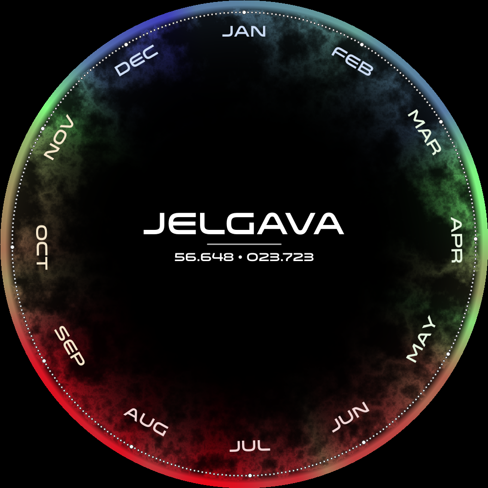

# Clock-Calendar

A calendar in the form of a clock that displays yearly temperature changes in the user's chosen location.  
Created for [NASA Space Apps Challenge 2023](https://www.spaceappschallenge.org/2023/find-a-team/arbuzs-talu-nekrit-7-vietas/)

## Dependancies
[Go](https://go.dev/doc/install)  
[Java Runtine Environment](https://ubuntu.com/tutorials/install-jre#1-overview)

## Setup
1. Create a [NASA Earthdata](https://urs.earthdata.nasa.gov/) profile and write your username/password at lines 22/23 in `main.go`
2. Get a [Google Maps API](https://console.cloud.google.com/google/maps-apis) key and put it in line 51 of `static/index.html`
3. Get a font(we suggest [Venera](http://www.losttype.com/font/?name=venera) with weight 900) and save it under `generator/data/Venera-900.otf`

## Running headless
If you are running the project without a display(eg. a server or through WSL) you can follow these tutorials on how to get that to work:  
[For WSL](https://virtualizationreview.com/articles/2017/02/08/graphical-programs-on-windows-subsystem-on-linux.aspx)  
[Other](https://gist.github.com/dropmeaword/b60eeeafd47bcf58e775)

## Usage
1. Run  `go run .`  to start the program  
1. Open `localhost:8080` in your browser  
1. Choose a location, a name and click generate!
